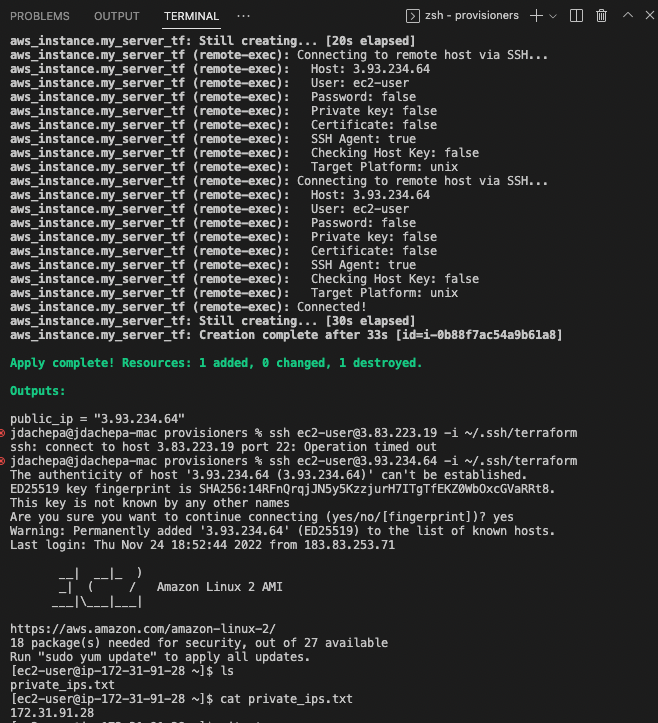

# Terraform commands

1. `terraform init` to download provider and setup. it's also used to install modules when needed

2. `terraform fmt` to format the code

3. `terraform validate` to validate the syntax (It's included in `terraform plan`)

4. `terraform plan` to show what the current config will do i.e., what resources it will create, delete, modify..

5. `terraform apply` Apply the shown changes to the provider

6. `terraform refresh` to refresh the values of exisitng/new variables using existing data/resources. 

7. `terraform output` to display all output variables with values

8. `terraform apply -auto-approve` to skip asking for "enter yes to approve"

9. `terrform apply -destroy` or `terraform destroy` to delete all resources

10. `terraform apply -refresh-only` to update the output variables from already applied resources.

11. Incase of updated a specific resource and we want to apply terraform only for that resource then run `terraform apply -replace="aws_instance.my_server_tf"` (here 'aws_instance.my_server_tf is that resource in my terraform code)

## Terraform Variables

1. we can pass from cmd i.e., `terraform plan -var=instance_type="t2.nano"`

2. create new terraform.tfvars file and declare the variables, and just run `terraform plan`

## Terraform points

1. As terraform doesn't create any AWS CF stacks or any cloud similar stack. Terraform stores its state in .tfstate files and we can backup them in terraform cloud if needed.

2. we can migrate from terraform remote backends to local by running `terraform init -migrate-state`

3. To migrate from terraform cloud to the local, follow the below points:
    i. make sure your code has the cloud config block at this point.
    ii. `mkdir -p terraform.tfstate.d/tfc-migration-test`
    iii. `terraform state pull > terraform.tfstate.d/tfc-migration-test/terraform.tfstate`
    iv. `mv .terraform/terraform.tfstate .terraform/terraform.tfstate.old`
    v. remove/comment the cloud config block in the terraform code.
    vi. `terraform init`

4. Incase of facing Apple m1 silicon chip - terraform issues, visit and use - https://github.com/kreuzwerker/m1-terraform-provider-helper; also check this StackOverflow thread - https://stackoverflow.com/a/74477115

5. For remote-exec we need to pass either the password or the private key for ssh type auth, but if the ssh file is a passphrase protected then we need to perform the below steps to pass passphrase protected file
    i. In local, run `ssh-add <ssh key path>`
    ii. remove `private_key` from remote-exec connection block and add `agent = true` 
    iii. output proof (refer below image)
    
    
6. 

### questions/ ToDo

1. We can also use 2 providers for 2 different regions (will need to check if possible with 2 different clouds)

2. We can also provide specific provider to be used for specific module

#### Other points to note

1. my terraform ssh file's password: our usual welcome password for 2022-23

2. login to ec2 machine -> ssh ec2-user@3.83.223.19 -i ~/.ssh/terraform (the ssh file should have 400 permissions)

3. 
